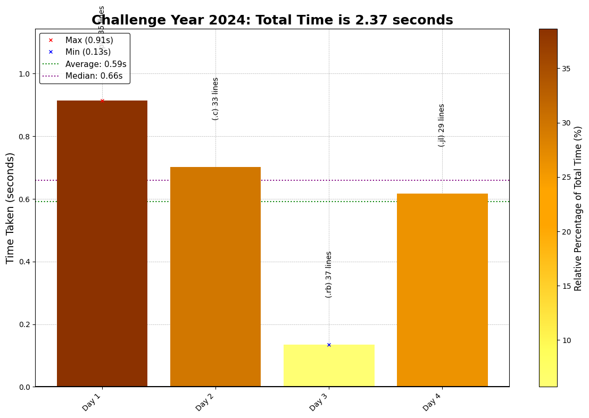

# Coding Challenge Summaries

This repository contains coding solutions for a Coding Challenge Codes. Each day's challenge offers unique puzzles requiring efficient coding, algorithmic thinking, and optimization.

## Day-by-Day Coding Overview

1. **Day 1 - Strings**: Read Text
2. **Day 2 - Numbers**: Perform Math