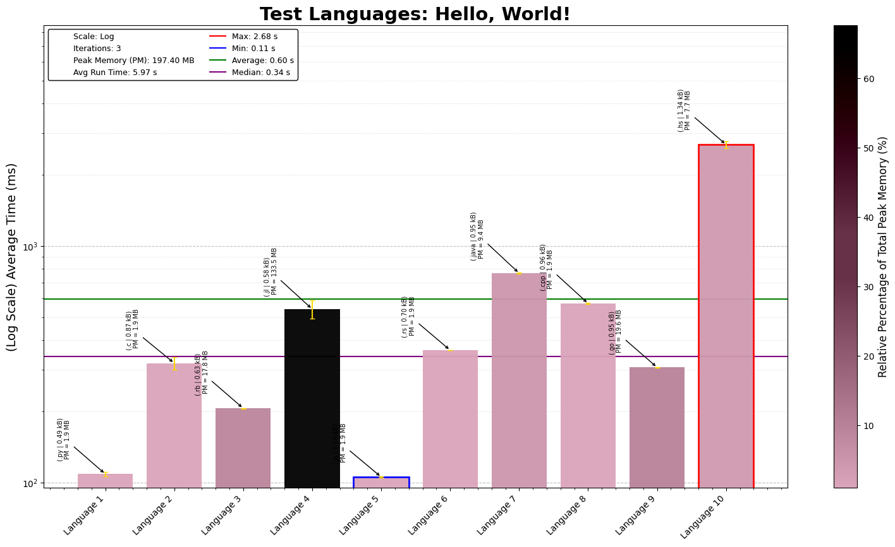

# Coding Challenge Summaries

This repository contains coding solutions for a Coding Challenge Codes. Each day's challenge offers unique puzzles requiring efficient coding, algorithmic thinking, and optimization.

## Day-by-Day Coding Overview

1. **Day 1 - Python**: Test Python
2. **Day 2 - C**: Test C
3. **Day 3 - Ruby**: Test Ruby
4. **Day 4 - Julia**: Test Julia
5. **Day 5 - JS**: Test Javascript
6. **Day 6 - Rust**: Test Rust
7. **Day 7 - Java**: Test Java
8. **Day 8 - C++**: Test C++
9. **Day 9 - GO**: Test GO
10. **Day 10 - Haskell**: Test Haskell